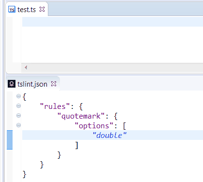
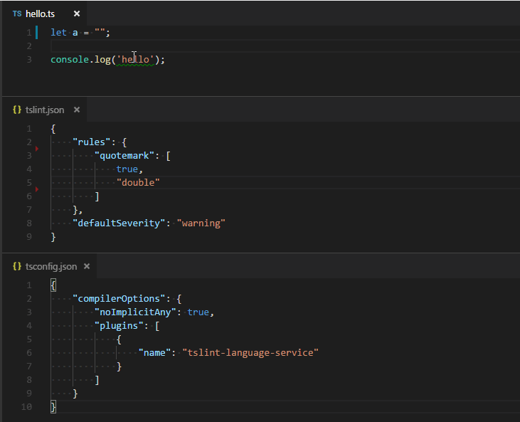

# tslint-language-service

[](http://travis-ci.org/angelozerr/tslint-language-service)
[](https://www.npmjs.org/package/tslint-language-service)  

TypeScript [language service plugin](https://blogs.msdn.microsoft.com/typescript/2017/04/27/announcing-typescript-2-3/) for [tslint](https://github.com/palantir/tslint). 

To use it the plugin:

 * install the plugin with `npm install tslint-language-service`
 
 * enable the plugin in your `tsconfig.json` file:

```json
{
  "compilerOptions": {
    "plugins": [
      { "name": "tslint-language-service"}
    ]
  }
}
```

 * If you are using TypeScript < 2.2.1, you must execute tsserver with [tsserver-plugins](https://github.com/angelozerr/tsserver-plugins).
 
Your `node_modules` folder should look like this:

* node_modules
  * tslint
  * tslint-language-service
  * typescript

**Notice** due to an issue in the implementation of the `no-unused-variable` rule ([issue[15344](https://github.com/Microsoft/TypeScript/issues/15344)]), this rule will be disabled by the plugin. You can use the typescript compiler options `noUnusedLocals` and `noUnusedParameters` instead. 

## Configuration options

**Notice** this configuration settings allow you to configure the behaviour of the tslint-language-service plugin. To configure rules and tslint options you should use the `tslint.json` file.

 * `configFile` - the configuration file that tslint should use instead of the default tslint.json.
 * `ignoreDefinitionFiles` - control if TypeScript definition files should be ignored.
 * `alwaysShowRuleFailuresAsWarnings` - always show rule failures as warnings, ignoring the severity configuration in the tslint.json configuration.
 * `disableNoUnusedVariableRule` - disable `no-unused-variable` rule.
 
Here a configuration sample:

```json
{
  "compilerOptions": {
    "plugins": [
      { "name": "tslint-language-service",
        "alwaysShowRuleFailuresAsWarnings": false,
        "ignoreDefinitionFiles": true,
        "configFile": "../tslint.json",
        "disableNoUnusedVariableRule": false
      }
    ]
  }
}
```

# Editors Support
 
All editors which consumes tsserver (VSCode, Sublime, Eclipse, etc) can use `tslint-language-service`. Here a demo with [Eclipse](https://github.com/angelozerr/typescript.java) and `tslint 5.0.0`



## Eclipse

Install [typescript.java](https://github.com/angelozerr/typescript.java/wiki/Installation-Update-Site) and you can use the `TypeScript Project wizard` which configures tslint-language-service.

## Visual Studio Code

*If you also have the [vscode-tslint](https://marketplace.visualstudio.com/items?itemName=eg2.tslint) extension in VS Code installed, please disable it to avoid that files are linted twice.*

To use the plugin with VS Code:
- If you are using the `vscode-tslint` extension disable or uninstall it.
- Install `typescript`, the `tslint-language-service`, and `tslint` into your workspace using `npm install typescript tslint tslint-language-service`.
- Open VS Code on the workspace
- Switch to the Typescript version that is installed locally in the workspace using the version switcher (see below) in the bottom right of the status bar.

The most important differences between the `vscode-tslint` extension and the `tslint-languageservice-plugin` are:
- The plugin shares the program representation with TypeScript. This is more efficient than the `vscode-tslint` extension which needs 
  to reanalyze the document.
- Since `vscode-tslint` lints one file a time only, it cannot support tslint rules that require the type checker. The language service plugin doesn't have this limitation.
- `vscode-tslint` provides additional [features](https://marketplace.visualstudio.com/items?itemName=eg2.tslint), please file issue requests for the features you are missing.


### Demo



# Development Setup 

This section describes how to setup your environment so that you can develop and test the language server plugin.

The folder `dev` contains a project with a `tsconfig.json` that enables the tslint-languageservice plugin a `tslint.json` and some test files with rule violations you can use for manual testing.

## VS Code

To compile the test for manual testing run `npm run devtest`, this script compiles the plugin and patches the `tslint-language-service` module inside the `dev` folder.

To test open VS Code on the dev folder and use the TypeScript version picker to switch to the local version of TypeScript. This version will use the patched `tslint-language-service` module.

To debug you use two versions of VS Code, e.g., the stable and the insider version. The idea is that one of them is configured to support attaching a debugger to the Typescript language server:
- Use the insider version for development and open it on the tslint-language-service workspace.
- Use the stable version for debugging opened on the `dev` folder of the tslint-language service.

To setup the stable version for debugging, you need to set the environment variable `TSS_DEBUG` to port 5859. In a command prompt/shell:
  - make sure that the stable version isn't running already
  - `set TSS_DEBUG=5859`
  - cd to the `dev` folder
  - `code .`

To debug the tslint-language-service plugin press `F5`. The `dev` workspace has a launch configuration that attaches through port 5859 to the language server. To set a break point open `node_modules\tslint-language-service\out\src\index.js`. You have to set the break point in the .js file, but you can step afterwards in the TypeScript source file.


 

